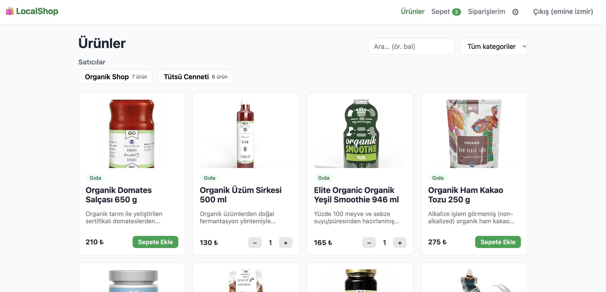

# 🛍 LocalShop



Yerel üreticilerin ürünlerini doğrudan müşterilere satabileceği online marketplace MVP'si.

## Kullanılan Teknolojiler

| Katman | Teknoloji |
|---|---|
| Frontend | React 19, TypeScript, Vite, React Router, Axios, saf CSS |
| Backend | Node.js, Express 5, TypeScript, Mongoose |
| Database | MongoDB |
| Doğrulama | Zod |
| Auth | JWT (jsonwebtoken), bcryptjs |
| Güvenlik | express-rate-limit, CORS whitelist, .env |
| Görsel yükleme | multer (JPEG/PNG/WebP, en fazla 2 MB) |
| API Dokümantasyonu | Swagger UI (`/api-docs`) |

## Proje Mimarisi

```
localshop/
├── backend/
│   └── src/
│       ├── config/        # env doğrulama (zod) + mongoose bağlantısı
│       ├── models/        # User (adresler gömülü), Product, Cart, Order, Payment
│       ├── routes/        # endpoint tanımları + route-bazlı rate limit
│       ├── controllers/   # HTTP katmanı — thin, sadece req/res
│       ├── services/      # iş mantığı — framework'ten bağımsız (fakePay dahil)
│       ├── middleware/    # authenticate, authorize, validate, errorHandler
│       ├── validators/    # zod şemaları
│       ├── i18n/          # kullanıcıya dönen mesajlar tek yerde
│       ├── uploads/       # yüklenen ürün görselleri (statik servis edilir)
│       └── docs/          # OpenAPI tanımı
└── frontend/
    └── src/
        ├── api/           # axios instance (token interceptor) + servis katmanı
        ├── context/       # AuthContext, CartContext, ToastContext
        ├── components/    # reusable: Navbar, ProductCard, ProductForm, Spinner, ErrorMessage
        ├── pages/         # 11 sayfa (Login … Payment, Settings, EditProduct)
        ├── i18n/          # arayüz metinleri
        └── routes/        # ProtectedRoute, RoleRoute
```

**Katman disiplini:** Controller HTTP'yi bilir, iş mantığını bilmez; service iş mantığını
bilir, HTTP'yi bilmez. FakePay saf bir fonksiyondur ve Express'e bağımlı değildir.

### Önemli tasarım kararları

- **Order snapshot:** Sipariş kalemleri, sipariş anındaki ürün adı ve fiyatını kopyalar.
  Satıcı sonradan fiyat değiştirse de geçmiş siparişler etkilenmez. `totalPrice` her zaman
  sunucuda hesaplanır — istemciden gelen tutara güvenilmez.
- **Ownership kontrolü:** `authorize('seller')` yetmez; her ürün güncelleme/silme işleminde
  `product.sellerId === req.user.id` doğrulanır. Sipariş detayında da aynı kural geçerlidir.
- **Çift ödeme engeli:** Yalnızca `PENDING_PAYMENT` / `PAYMENT_FAILED` durumundaki sipariş
  ödenebilir. Stok yalnızca başarılı ödemede düşer.
- **Kart verisi asla saklanmaz:** Payment kaydı yalnızca `orderId`, `status`,
  `transactionId` içerir. Kart bilgisi sadece request body'de yaşar.
- **Adres de snapshot'tır:** Kullanıcının birden fazla adresi olabilir; sipariş verilirken
  seçilen adresin başlığı ve metni siparişe kopyalanır. Müşteri adresi sonradan silse bile
  satıcı gönderiyi yapacağı adresi görmeye devam eder.
- **Tek yönlü durum akışı:** Sipariş durumu yalnızca ileri gider —
  `PAID → SHIPPED → DELIVERED`. Adım atlanamaz, geri alınamaz; kural sunucuda uygulanır.

## Kurulum

Önkoşullar: Node.js 20+, MongoDB 8.0 (`brew install mongodb-community@8.0`).
`scripts/db.sh` mongod'u proje içindeki `.data/mongo` dizininde başlatır; sistemde zaten
27017'de dinleyen bir mongod varsa ona dokunmaz.

```bash
# 1) MongoDB'yi başlat (zaten çalışıyorsa dokunmaz)
./scripts/db.sh start

# 2) Backend
cd backend
cp .env.example .env        # JWT_SECRET değerini değiştirin
npm install
npm run dev                 # http://localhost:4000

# 3) Frontend (ayrı terminal)
cd frontend
npm install
npm run dev                 # http://localhost:5173
```

- API dokümantasyonu: http://localhost:4000/api-docs
- Health check: http://localhost:4000/api/health

## Fake Payment (FakePay)

Gerçek ödeme altyapısı yoktur; ödeme simüle edilir.

| Kart | Sonuç |
|---|---|
| `4242 4242 4242 4242` | Ödeme başarılı → sipariş `PAID`, stok düşer |
| `4000 0000 0000 0000` | Ödeme reddedilir → sipariş `PAYMENT_FAILED` |
| Diğer | Luhn + son kullanma kontrolünden geçerse başarılı |

## Güvenlik Önlemleri

- Password hashing (bcrypt, cost 12) — şifre hiçbir response'ta yer almaz (`select: false`)
- JWT authentication (1 gün expiry) + role-based authorization + ownership kontrolü
- Zod ile input validation (body ve query)
- Rate limiting: global 300/15dk, auth 20/15dk, ödeme 10/15dk
- CORS origin whitelist (`.env` üzerinden)
- Ortam değişkenleri `.env` dosyasında; `.env` git'e girmez
- Kart bilgileri veritabanında saklanmaz; arama regex'lerinde injection koruması

## Kullanıcı Rolleri

- **Customer:** ürünleri görüntüler, arar, filtreler; ürün kartından tek tıkla sepete ekler
  ve adedini değiştirir; teslimat adresi seçerek sipariş oluşturur; ödeme yapar; sipariş
  geçmişini ve durumunu görür.
- **Seller:** ürün ekler/düzenler/siler; kendi ürünlerini görsel ve stoklarıyla listeler;
  gelen siparişleri teslimat adresiyle birlikte görür ve durumlarını ilerletir.

Her iki rol de **Ayarlar** (⚙) sayfasından kendi adreslerini yönetebilir.

## Sipariş Yaşam Döngüsü

```
sepet → POST /api/orders (adres seçilir)  →  PENDING_PAYMENT
             ↓ POST /api/payments/pay
        başarılı → PAID          başarısız → PAYMENT_FAILED (tekrar denenebilir)
             ↓ PATCH /api/orders/:id/status  (seller)
          SHIPPED
             ↓ PATCH /api/orders/:id/status  (seller)
         DELIVERED
```

Durumu yalnızca siparişte ürünü bulunan satıcı ilerletebilir. Bir sipariş birden fazla
satıcının ürününü içerebilir; bu MVP'de durum siparişin tamamına aittir, satıcı bazında
ayrı ayrı tutulmaz.
